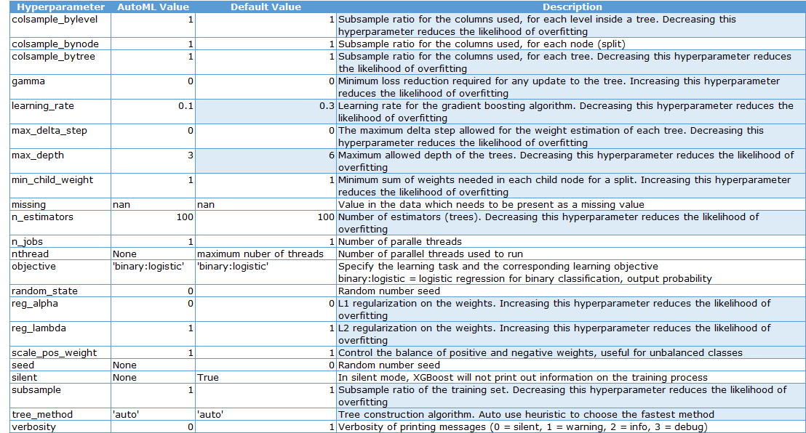
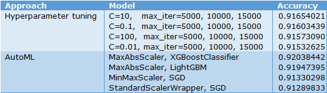
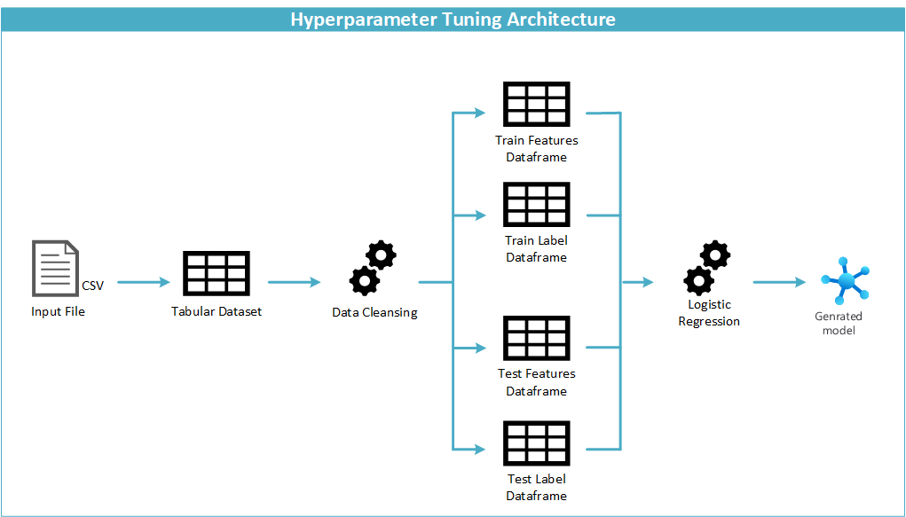
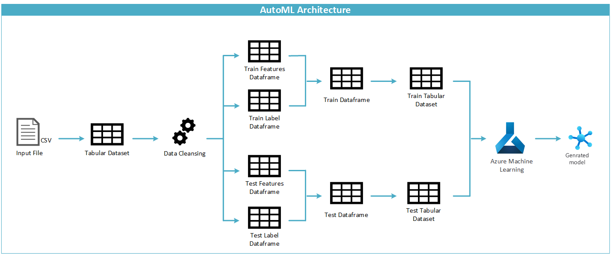
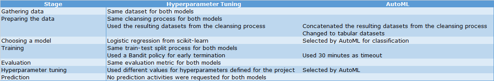

# Optimizing an ML Pipeline in Azure

## Overview
This project is part of the Udacity Azure ML Nanodegree.
In this project, we build and optimize an Azure ML pipeline using the Python SDK and a provided Scikit-learn model.
This model is then compared to an Azure AutoML run.

## Summary

### Problem Statement
The dataset provided for the project is the UCI [Bank Marketing Data Set](https://archive.ics.uci.edu/ml/datasets/Bank+Marketing).
The data is related with direct marketing campaigns of a Portuguese banking institution.  
The classification goal is to predict if the client will subscribe a term deposit, based in the features provided such as age, job, marital status, education.    

### Solution
Two different approaches were used to solve the classification problem:
* Hyperparameter tuning.
* AutoML.

The evaluation metric was accuracy.  

The best performing model was the AutoML generated model with MaxAbsScaler and XGBoostClassifier.  
* Although a Voting Ensemble would have provided better results, the aim of the test conducted was to make a fair comparison between single models.  
* MaxAbsScaler is an automatic featurization that scales each feature by its maximum absolute value (https://docs.microsoft.com/en-us/azure/machine-learning/concept-automated-ml?view=azure-ml-py).  
* XGBoostClassifier is a gradient boosting classifier based on xgboost (https://docs.getml.com/latest/api/getml.predictors.XGBoostClassifier.html).  
     * XGBoost is an implementation of the gradient tree boosting algorithm that is widely recognized for its efficiency and predictive accuracy.  
     * Gradient tree boosting trains an ensemble of decision trees by training each tree to predict the prediction error of all previous trees in the ensemble.  

### Process Followed
The [7 steps](https://livecodestream.dev/post/2020-06-02-7-steps-of-machine-learning/) that any Machine Learning process should follow are:
1. Gathering data.
2. Preparing the data.
3. Choosing a model.
4. Training.
5. Evaluation.
6. Hyperparameter tuning.
7. Prediction.

A detailed explanation for the processes followed in each approach, is provided in the corresponding section (Scikit-learn Pipeline and AutoML).  

## Scikit-learn Pipeline (Hyperparameter Tuning)

### 1. Gathering Data
The dataset was provided as part of the project initial code at: https://automlsamplenotebookdata.blob.core.windows.net/automl-sample-notebook-data/bankmarketing_train.csv
This dataset was used for both approaches (hyperparameter tuning and AutoML).  
The analysis performed on the dataset is in the [Exploratory Data Analysis notebook](Exploratory%20Data%20Analysis.ipynb).  

### 2. Preparing the Data
The initial code provided for the project included a function to clean data (clean_data) in the [train.py](train.py) file.  
* For categorical features with binary values, it changed the value to 0/1.  
* For categorical features with multiple values, it performed one-hot encoding.  

The cleaning function received a tabular dataset as input, cleaned it, and provided two dataframes: a feature dataset and a label dataset.  
This code was used for both approaches (hyperparameter tuning and AutoML).  
For the hyperparameter approach, the dataframes were used with no further changes.  
The analysis and test performed on the code is in the [train Validation notebook](train%20Validation.ipynb).  

### 3. Choosing a Model
The initial code provided for the project in the [train.py](train.py) file defined:
* The model to use: Logistic Regression classification model from the [Scikit-learn library](https://scikit-learn.org/stable/modules/generated/sklearn.linear_model.LogisticRegression.html) .  
* The hyperparameters to test: inverse of regularization strength (C) and maximum number of iterations (max_iter).  
* The metric for evaluation: Accuracy.  

The analysis and test performed on the code is in the [train Validation notebook](train%20Validation.ipynb).  

### 4. Training
The feature dataframe and the label dataframe were splitted into training and testing dataframes.  
* The proportion selected was 70-30, since it is the recommended value in most of the literature I found.
* The random state was set to 0, to ensure that the same random combination is used between runs.

An initial manual training of the model was performed in the [train Validation notebook](train%20Validation.ipynb), to test some values for the hyperparameters.  

The requested training process for the project was performed in the [udacity-project-H notebook](udacity-project-H.ipynb) and the steps followed were:
* Setup.
  * Initialize the Azure workspace an experiment.  
  * Create the compute cluster.  
* Hyperparameter run.  
  * Create the environment (dependencies).  
  * Define the hyperparameter space, parameter sampler, and early stopping policy.  
  * Submit and monitor the hyperdrive runs.  
  * Find and register the best model.  

#### Definition of the Parameter Space
This section was one of the core aspects for this approach of the project, since the values selected for the hyperparameters affected the evaluation metric of the models.  

As stated previously, the hyperparameters to test were defined in the initial code provided for the project were:
* Inverse of regularization strength (C).  
* Maximum number of iterations (max_iter).  

**Inverse of regularization strength.**  
The default value for this hyperparameter is 1.  
Lower values produce models that tend to under fit and higher values produce models that tend to over fit.  

The values selected for the hyperparameter sampler were two orders of magnitude from the default value (from 0.01 to 100).  
The aim was to confirm the hypothesis that extreme values (0.01 and 100) would produce worse *accuracy* results that the default value.  
Regarding values closer to the default value (0.1 and 10), the aim was to find if slightly under fitting/over fitting models would produce better *accuracy* results.  

**Maximum number of iterations.**  
The default value for this hyperparameter is 100.  
From the initial manual tests conducted, values lower that 5000 produced error messages, since the algorithm was not able to converge to a solution.  
Therefore, higher values were selected: 5000, 10000, and 15000.  
The aim was to confirm the hypothesis that too many iterations would not necessarily produce better results.  

#### Parameter Sampler
For hyperparameter sampling, there are 3 types of sampling algorithms:
* Bayesian Sampling
* Grid Sampling
* Random Sampling

**Bayesian Sampling.**  
Picks samples based on how previous samples performed, so the new samples improve the primary metric.  
It is recommended if there is enough budget to explore the hyperparameter space and does not support early termination policies.  

**Grid Sampling.**  
Performs a simple grid search over all possible values.  
It is recommended if there is enough budget to exhaustively search over the search space. Supports early termination of low-performance runs.  

**Random Sampling.**
Hyperparameters are randomly selected from the defined search space.  
It supports early termination of low-performance runs.  

Random sampling was selected for the test, since it is the algorithm that consumes less resources and accepts an early termination policy.  
* The code provided for the project stated that an early termination policy should be used, so Bayesian sampling was not considered for the test.  
* As part of the lessons for this Nanodegree, a comparison was performed between Grid sampling and Random sampling. Grid sampling provided a marginal increase in performance of the model, so it was not considered for the test, due the overhead it would cause in resources consumption.  

Reference: https://docs.microsoft.com/en-us/azure/machine-learning/how-to-tune-hyperparameters#define-search-space  

#### Early Stopping Policy
This section was the one of the core aspects for this approach of the project.  

An early termination policy improves computational efficiency by automatically terminating poorly performing runs.  
For aggressive savings, a *Bandit Policy* with small allowable slack is recommended.  
Bandit is based on slack factor/slack amount and evaluation interval. The policy early terminates any runs where the primary metric is not within the specified slack factor/slack amount with respect to the best performing training run.  

References: [Tune hyperparameters for your model with Azure Machine Learning](https://docs.microsoft.com/en-us/azure/machine-learning/how-to-tune-hyperparameters) and [Define a Bandit policy for early termination of HyperDrive runs](https://azure.github.io/azureml-sdk-for-r/reference/bandit_policy.html#:~:text=Bandit%20is%20an%20early%20termination,the%20best%20performing%20training%20run.).  

The values selected for the policy were a *slack factor* of 0.1 and a *evaluation interval* of 2.  
The early termination policy is applied every 2 intervals, when metrics are reported. Any run whose accuracy is less than (1 / (1 + 0.1)) or 91\% of the best run will be terminated.  

### 5. Evaluation
As stated earlier, the evaluation metric defined in the initial code provided for the project in the [train.py](train.py) file, was *accuracy*.  
The selection of the best model was performed using the *hyperdrive_run* libraries of AzureML.  

The models using an *inverse of regularization strength* of 10 provided the best result, regardless the *maximum number of iterations*.  

### 6. Hyperparameter Tuning
This was executed as part of the training process.  

### 7. Prediction
No prediction activities were requested as part of the project.  

## AutoML

### 1. Gathering Data
The dataset was provided as part of the project initial code at: https://automlsamplenotebookdata.blob.core.windows.net/automl-sample-notebook-data/bankmarketing_train.csv
This dataset was used for both approaches (hyperparameter tuning and AutoML).  
The analysis performed on the dataset is in the [Exploratory Data Analysis notebook](Exploratory%20Data%20Analysis.ipynb).  

### 2. Preparing the Data
Although AutoML provides automatic featurization as part of its processes, the initial code provided for the project stated that function to clean data should be used.  
This would assure that both approaches (hyperparameter tuning and AutoML) performed using the same basis, without the influence of the automatic featurization for AutoML.  

The initial code provided for the project included a function to clean data (clean_data) in the [train.py](train.py) file.  
* For categorical features with binary values, it changed the value to 0/1.  
* For categorical features with multiple values, it performed one-hot encoding.  

The cleaning function received a tabular dataset as input, cleaned it, and provided two dataframes: a feature dataset and a label dataset.  
This code was used for both approaches (hyperparameter tuning and AutoML).  
For the AutoML approach, the dataframes were concatenated, since the training dataset must include the features and the label.  
The concatenated training and test datasets were exported to csv files and loaded to a tabular dataset, so these could be used by AutoML.  

The analysis and test performed on the code is in the [train Validation notebook](train%20Validation.ipynb).  

### 3. Choosing a Model
Since AutoML selects the models and hyperparameters to be tested, the parameters that were specified were:
* task: classification.  
* primary metric: accuracy.  
* training_data: the train tabular dataset explained in the previous section.  
* label_column_name: 'y'.  

For the first test:  
* n_cross_validations: 2

For the second test:  
* validation_data: the test tabular dataset explained in the previous section.  

### 4. Training
The initial code provided for the project seemed to have an incongruence in the definition requested for the configuration.  
It stated that the dataset should be splitted into training and testing datasets (as it was performed for hyperparameter tuning).  
It also stated that the n_cross validations parameter should be defined, instead of allowing the use of the testing dataset.  

This incongruence affected the results of the AutoML approach, since it was receiving a smaller training dataset and the generated models achieved lower *accuracy* values.  
A second test was conducted, using the testing dataset instead of n_cross validation.  

AutoML uses model ensembles as the final step of its process. This feature was disabled in the second test, to get a fair comparison with hyperparameter tuning, between a single algorithm and not a combination of them.  

The feature dataframe and the label dataframe were splitted into training and testing dataframes.  
* The proportion selected was 70-30, since it is the recommended value in most of the literature I found.
* The random state was set to 0, to ensure that the same random combination is used between runs.

The requested training process for the project was performed in the [udacity-project-A1](udacity-project-A1.ipynb) and [udacity-project-A2](udacity-project-A2.ipynb) notebooks.  
The steps followed were:
* Setup.
  * Initialize the Azure workspace an experiment.  
  * Create the compute cluster.  
  * Load and clean the dataset.  
  * Create training and testing datasets.  
* AutoML run.  
  * Set up AutoML configuration.  
  * Submit and monitor the hyperdrive runs.  
  * Find and save the best model.  

### 5. Evaluation
As stated earlier, the evaluation metric defined for hyperparameter tuning in the initial code provided for the project in the [train.py](train.py) file, was *accuracy*.  
To get a fair comparison with AutoML, the same evaluation metric was used.  
The selection of the best model was performed using the *Run* libraries of AzureML.  

For the first test, the best model used *VotingEnsemble*.  
For the second test, the best model used *MaxAbsScaler* and *XGBoostClassifier*.  

* MaxAbsScaler is an automatic featurization that scales each feature by its maximum absolute value (https://docs.microsoft.com/en-us/azure/machine-learning/concept-automated-ml?view=azure-ml-py).  
* XGBoostClassifier is a gradient boosting classifier based on xgboost (https://docs.getml.com/latest/api/getml.predictors.XGBoostClassifier.html).  
     * XGBoost is an implementation of the gradient tree boosting algorithm that is widely recognized for its efficiency and predictive accuracy.  
     * Gradient tree boosting trains an ensemble of decision trees by training each tree to predict the prediction error of all previous trees in the ensemble.  

#### AutoML Generated Hyperparameter Analysis
The hyperparameters generated by AutoML for the XGBoostClassifier were:

The hyperparameters that affect the model performance are those marked in light blue color. These affect the likelihood of overfitting.  
Most of them use the default value, except for:  
* learning_rate
* max_depth

**Learning rate.**  
Determines the step size at each iteration while moving toward a minimum of a loss function. It represents the speed at which a machine learning model "learns".  
In setting a learning rate, there is a trade-off between the rate of convergence and overshooting. A too high learning rate will make the learning jump over minima but a too low learning rate will either take too long to converge or get stuck in an undesirable local minimum.  
https://en.wikipedia.org/wiki/Learning_rate

Since the value selected by AutoML is higher than the default value, it seems that the model was taking too long to converge, therefore the value was increased.  

**Maximum depth.**  
In gradient boosting, we can control the size of decision trees, also called the number of layers or the depth.  
Shallow trees are expected to have poor performance because they capture few details of the problem and are generally referred to as weak learners. Deeper trees generally capture too many details of the problem and overfit the training dataset, limiting the ability to make good predictions on new data.  
https://machinelearningmastery.com/tune-number-size-decision-trees-xgboost-python/

Since the value selected by AutoML is higher than the default value, it seems that the model was not able to make good predictions, therefore the value was increased.  

The model explanation for the relevant features is in the [udacity-project-A2](udacity-project-A2.ipynb) notebook.  
The model visualization using [Netron](https://github.com/lutzroeder/Netron) is in the [best_model.onnx.png](images/best_model.onnx.png) file.  

### 6. Hyperparameter Tuning
This was executed by AutoML as part of the training process.  

### 7. Prediction
No prediction activities were requested as part of the project.  

## Pipeline Comparison

### Performance Comparison

### Architecture Comparison

### Results Analysis
The difference in accuracy between the best models of both approaches is almost 0.4%, which is not quite significative.  
Nevertheless AutoML tested a considerable number of different algorithms, which would imply investing a lot of time if done manually.  

## Future Work

### AutoML Built-in Processes
The project stated that both approaches should use the same cleansing function, as well as the same test-train split process, to obtain a fair comparison based solely on the model type and hyperparameter tuning.

Nevertheless, to get a better understanding of the benefits of AutoML, further tests could use automated featurization and n-cross validation (using the complete dataset, not the train-test split datasets), to verify if the built-in capacities are capable of detecting hidden insights that might have been overseen by the manual cleansing and train-test split processes.  

### Additional Datasets
The project stated the dataset to be used, which is a training dataset. There are two additional datasets available for [validation](https://automlsamplenotebookdata.blob.core.windows.net/automl-sample-notebook-data/bankmarketing_validate.csv) and [testing](https://automlsamplenotebookdata.blob.core.windows.net/automl-sample-notebook-data/bankmarketing_test.csv), which could be used to improve the performance of the models, as ML models tend to increase their performance when more data is available.  

### Early Stopping Policies
The project stated that a 30 minute timeout should be used for the AutoML approach, to prevent a timeout in the Azure instance provided.  
Further tests could be performed increasing the timeout, to discover if there any models that could obtain better accuracy results within a reasonable time window.  
